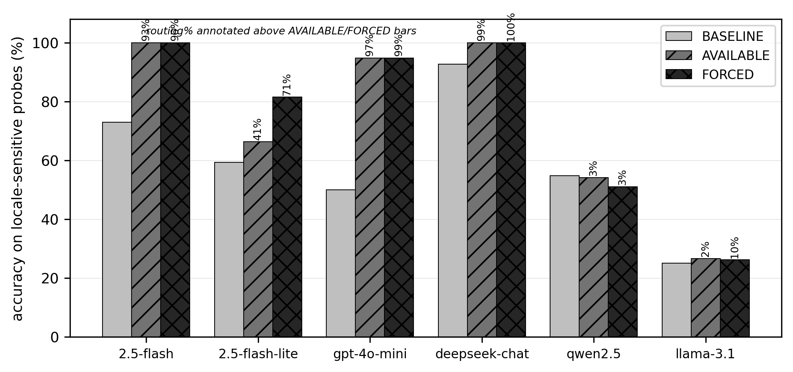

# ZhToolLocale

**Do LLM agents silently corrupt Chinese-locale values when they call tools?**
Yes — and this benchmark measures it, detects it, and shows the fix.

When an agent turns a Chinese request into a tool call, it must convert locale
semantics into canonical executable arguments: `一万二` → `12000` (not `10002`),
`两斤` → `1.0` kg (`1 斤 = 0.5 kg`), `中秋节` → `2026-09-25`. Getting this wrong
produces a **schema-valid, executable, and silently wrong** call — invisible to
tool-*selection* metrics and dangerous in finance/scheduling/logistics.
ZhToolLocale isolates conversion correctness with **deterministic,
library-computed gold answers** (no human judgment), measures it across models,
shows that the failures are **detectable** and **deployment-relevant**, and
demonstrates that a **deterministic converter tool** recovers capable models.

## Headline results

Accuracy on the focused set (105 probes; lunar dates + numeral nesting + units),
canonical 6-model matrix (official `deepseek-chat`):

| Model | tier-1 (23) | focused (105) | lunar | with converter tool (AVAILABLE) |
|---|---|---|---|---|
| gemini-2.5-flash | 100.0% | 75.2% | 28% | **100.0%** |
| gemini-2.5-flash-lite | 95.7% | 60.0% | 3% | 66% (→ 81% FORCED) |
| gpt-4o-mini | 91.3% | 54.3% | 0% | **94.8%** |
| deepseek-chat | 95.7% | **93.3%** | 81% | **100.0%** |
| qwen2.5-7b | 78.3% | 55.9% | 3% | 54% (won't route) |
| llama3.1-8b | 47.8% | 25.7% | 0% | 27% (won't route) |

**Lunar-date conversion is a near-universal failure** (only `deepseek-chat`
clears 50%), yet a deterministic `lunar_to_gregorian` tool lifts capable models
to 95–100% — the gap is *tool-routing*, not reasoning. The 7-8B tier (qwen,
llama) does not adopt the tool even when instructed.



*Fig. 2 — baseline vs converter-AVAILABLE vs converter-FORCED, with routing% annotated.
See [`results/FINAL_RESULTS_v2.md`](results/FINAL_RESULTS_v2.md) for the full tables, 95% bootstrap CIs, and significance tests.*

## Reproduce in one command (zero API keys)

```bash
pip install -r requirements.txt

# Linux / macOS:
ZTL_PROVIDER=mock python src/models.py

# Windows (PowerShell) — set UTF-8 output first (probes/outputs contain Chinese):
$env:PYTHONIOENCODING="utf-8"; $env:ZTL_PROVIDER="mock"; python src\models.py
```

The `mock` provider runs the full harness offline (built-in canned answers) so you
can verify scoring, per-category and per-layer breakdowns end-to-end with **no
keys and no network**. The per-probe report prints Chinese probe text, so on
Windows set `PYTHONIOENCODING=utf-8` (above) or use a UTF-8 terminal — otherwise
Python's default Windows code page raises a `UnicodeEncodeError` mid-report. On
Linux/macOS this is unnecessary (stdout is already UTF-8).

Run a real model (OpenAI-compatible providers; pick the probe set with `ZTL_PROBES`):

```bash
export ZTL_PROVIDER=gemini        # gemini | openai | deepseek | ollama | ...
export ZTL_API_KEY=sk-...          # your key (never stored)
export ZTL_MODEL=gemini-2.5-flash
export ZTL_PROBES=probes_focus_seed.json   # default: probes_seed.json (tier-1)
python src/models.py
```

Providers map to base URLs in `src/models.py` (`PROVIDERS`): Gemini, OpenAI,
DeepSeek, DashScope/Qwen, Moonshot/Kimi, Zhipu/GLM, and local Ollama. Keys are
read from `ZTL_API_KEY` at runtime and are **never written to any file**.

## Mint fresh, contamination-resistant probes

Golds are *computed*, not memorized, so you can regenerate the whole benchmark for
**any future reference date** — defeating training-data contamination:

```bash
python src/generators/gen_focused.py    # lunar via lunardate, numerals/units by closed form
python src/generators/gen_memo.py       # matched name/date memorization pairs
python src/generators/compute_golds.py  # prints the gold-verification table
```

Each generator prints a gold-verification table before writing `probes/*.json`,
so every answer is auditable against the source library (`lunardate`, `ephem`).

## Key design points

- **Computed golds, not human labels** — lunar dates via `lunardate`, the 清明 solar
  term via `ephem`, numerals/units by closed-form decomposition. Fully reproducible.
- **ERR ≠ FAIL** — API errors / empty outputs are scored `[ERR]` and excluded from
  both numerator and denominator, so infrastructure noise never inflates error rates.
- **Pre-registration** — ambiguous probes are flagged *before* runs; the one
  genuinely two-valued probe (`f-L07`, 明年腊八) was dropped by pre-registered rule.
- **Paraphrase triplets** — every focused probe appears in 3 phrasings, enabling a
  self-consistency metric and a disagreement-based error detector.
- **Matched-pair causal control** — festival-name vs identical-lunar-date pairs test
  recall-vs-conversion directly (result: no memorization advantage; see paper).

## Citation

```bibtex
@misc{zhang2026zhtoollocale,
  title  = {ZhToolLocale: Measuring Chinese-Locale Argument Corruption in Tool-Calling LLMs},
  author = {Zhang, Ruiyang},
  year   = {2026},
  note   = {arXiv:XXXX.XXXXX},
  url    = {https://github.com/ryonzhang/zhtoollocale}
}
```

Paper: _link placeholder (arXiv id to be added)_. See [`CITATION.cff`](CITATION.cff).

## Requirements

See [`requirements.txt`](requirements.txt): `openai`, `lunardate`, `ephem` (core);
`numpy`, `scipy`, `matplotlib` (stats + figures). Reproducibility pins in
[`repro_manifest.md`](repro_manifest.md).

## License

Code: MIT ([`LICENSE`](LICENSE)). Probes & data: CC-BY-4.0 ([`DATA_LICENSE`](DATA_LICENSE)).
